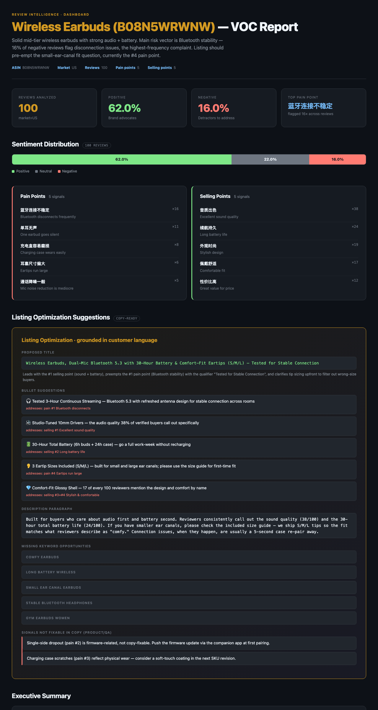

<p align="center">
  
</p>

<h1 align="center">Review Analyzer</h1>

<p align="center">
  <strong>Agent-native voice-of-customer for e-commerce.</strong><br>
  <em>Drop in an ASIN or a CSV — get sentiment, pain points, copy-ready listing improvements,<br>
  and a black-gold HTML dashboard. 6 MCP tools. Backed by the most stable Amazon review data layer.</em>
</p>

<p align="center">
  <a href="#quick-start"></a>
  <a href="#tools"></a>
  <a href="#data-layer"></a>
  <a href="https://github.com/cline/mcp-marketplace/issues/1602"></a>
  <a href="https://github.com/punkpeye/awesome-mcp-servers/pull/6528"></a>
  <a href="LICENSE"></a>
</p>

<p align="center">
  <a href="docs/screenshots/dashboard.png">
    
  </a>
</p>
<p align="center"><sub>↑ Sample dashboard: B08N5WRWNW · 100 reviews · sentiment + pain points + listing improvements, generated by <code>render_dashboard</code>.</sub></p>

---

## TL;DR

Two inputs, six tools, three outputs.

```
   ┌─────────────┐                                            ┌──────────────┐
   │   ASIN      │──┐                                       ┌─│ Markdown     │
   └─────────────┘  │      ┌─────────────────────────┐      │ │ report       │
                    ├──────▶ 6 agent-callable tools  ├──────┤ ├──────────────┤
   ┌─────────────┐  │      └─────────────────────────┘      │ │ Structured   │
   │  CSV / XLSX │──┘   fetch_reviews   analyze_csv         │ │ JSON         │
   └─────────────┘      analyze_reviews voc_full            │ ├──────────────┤
                        extract_listing_improvements        └─│ Black-gold   │
                        render_dashboard                      │ HTML deck    │
                                                              └──────────────┘
```

- **Inputs** — Amazon ASIN (auto-fetched via Shulex VOC OpenAPI, 10 markets) **or** any review CSV / Excel (Helium 10 / eBay / Shopify / custom — fuzzy column detection)
- **Outputs** — Markdown report · structured JSON · standalone HTML dashboard
- **Surface** — MCP server (works in Codex / Claude Code / Cursor / Cline / Continue) **and** Skill

---

## Quick start

### Option A — As an MCP server (recommended)

Requires [`uv`](https://docs.astral.sh/uv/getting-started/installation/).

Add this to your MCP client config (Codex, Claude Code, Claude Desktop, Cursor, Windsurf, VS Code Copilot, Cline, Continue.dev):

```json
{
  "mcpServers": {
    "voc-amazon-reviews": {
      "command": "uvx",
      "args": ["voc-amazon-reviews-mcp"],
      "env": {
        "VOC_API_KEY": "your-shulex-key",
        "OPENAI_API_KEY": "your-openai-key"
      }
    }
  }
}
```

Get a free Shulex API key (100 calls/month, no credit card): [apps.voc.ai/openapi](https://apps.voc.ai/openapi).

First run resolves dependencies in ~5s; subsequent runs are instant.

#### Try it

Ask any MCP-compatible agent:

> Run a VOC report on `B08N5WRWNW`, render the dashboard, and write it to `~/Desktop/voc.html`.

The agent will call `voc_full` → `render_dashboard` and hand you the file.


### Option B — One-shot CLI

```bash
bash voc.sh B08N5WRWNW --limit 100 --market US
```

### Option C — Bring your own reviews (CSV)

```bash
# Drop in any reviews CSV (Helium 10 export, eBay scrape, Shopify, custom)
python -c "from mcp_server.tools import analyze_csv, render_dashboard; \
  r = analyze_csv('reviews.csv', product_name='My Product'); \
  render_dashboard(r, output_path='dashboard.html')"
```

---

## Tools

| # | Tool | Input | Use when |
|---|---|---|---|
| 1 | `fetch_reviews` | ASIN | You want raw reviews; you'll analyze them yourself |
| 2 | `analyze_reviews` | reviews JSON | You already have reviews and want the VOC report |
| 3 | `voc_full` | ASIN | Default "give me a VOC report" — fetch + analyze in one call |
| 4 | `extract_listing_improvements` | ASIN | **★ Differentiator** — copy-ready title / 5 bullets / description grounded in customer language |
| 5 | `analyze_csv` | CSV / Excel path or URL | The product is NOT on Amazon, or you have your own scrape |
| 6 | `render_dashboard` | VOC report | Generate a standalone black-gold HTML dashboard, no external deps |

All 6 tools speak MCP. All return JSON-serializable dicts. Full schemas in [`mcp_server/README.md`](mcp_server/README.md).

---

## Data layer — why this is the moat

Most "AI review tools" are a thin LLM wrapper over a brittle scraper. **We invert that.** The data layer is the moat:

| | Typical seller-tool data layer | **review-analyzer** |
|---|---|---|
| **Source** | Web scraper / undocumented scrape API | Paid [Shulex VOC OpenAPI](https://apps.voc.ai/openapi) |
| **Reliability** | Breaks when Amazon updates HTML | API-grade, no DOM dependencies |
| **Markets** | US-only or 2-3 markets | **10**: US, CA, MX, GB, DE, FR, IT, ES, JP, AU |
| **Volume** | 10–50 reviews (free-tier cap) | Up to **1,000 reviews per ASIN** |
| **Freshness** | Daily snapshots, sometimes cached for days | Live pull |
| **Schema** | Strings only | Full: verified-purchase, helpful votes, vine, variant, dates |
| **Non-English markets** | Often broken / omitted | Native captures + AI translation |
| **Access** | Locked behind a UI | curl + JSON, fully scriptable, MCP-ready |

**For non-Amazon platforms**, `analyze_csv` accepts any review file — fuzzy column matching detects `内容` / `评价` / `body` / `review` / `content` so you don't have to reformat. Bring data from anywhere, get the same VOC report.

---

## vs. the alternatives

| | **review-analyzer** | Helium 10 / Data Dive | review-analyzer-skill (Buluu) | Generic review scrapers |
|---|---|---|---|---|
| **Input** | ASIN **or** CSV | ASIN (manual UI) | CSV only | URL |
| **Markets** | 10 | 1-3 | depends on user's data | 1 |
| **Output** | JSON + Markdown + **HTML dashboard** | UI dashboard (locked) | CSV + MD + HTML dashboard | Raw CSV |
| **MCP-callable** | ✅ | ❌ | ❌ Claude Code only | ❌ |
| **Listing copy gen** | ✅ `extract_listing_improvements` (cite-by-pain-point) | Keyword research only | ❌ | ❌ |
| **Cost** | Shulex API + Anthropic API ($0.05-0.20/listing) | $99-249/month subscription | Free (uses your Claude quota) | Free, brittle |
| **Open source** | ✅ MIT | ❌ | ✅ MIT | varies |

> **Credit & inspiration**: The 22-dimension tag system, fuzzy CSV column detection, and black-gold dashboard aesthetic were inspired by [buluslan/review-analyzer-skill](https://github.com/buluslan/review-analyzer-skill) (MIT). We adapted them onto an MCP-native architecture with the Shulex VOC OpenAPI data layer.

---

## Architecture

```
mcp_server/
├── server.py                  # 6 @mcp.tool decorators
├── tools.py                   # implementations (subprocess wrappers + OpenAI SDK)
├── csv_loader.py              # fuzzy column detection for CSV/Excel input
├── dashboard.py               # HTML rendering
├── dashboard_template.html    # black-gold template (placeholders)
├── tag_system.yaml            # 22-dim tag schema (customizable per category)
├── schemas.py                 # pydantic structured-output models
└── tests/                     # 36 unit tests (subprocess + OpenAI mocked)

fetch.sh / analyze.sh / voc.sh   # shell pipeline behind tools 1-3
```

- **fetch + analyze loop**: shell scripts (proven, reproducible, easy to debug)
- **listing rewrites**: OpenAI SDK direct (`OPENAI_LISTING_MODEL`, default `gpt-4.1`)
- **dashboard**: pure stdlib HTML rendering, no node / no react

---

## Distribution / where to find us

| Channel | Status |
|---|---|
| [punkpeye/awesome-mcp-servers PR #6528](https://github.com/punkpeye/awesome-mcp-servers/pull/6528) | ✅ Open |
| [cline/mcp-marketplace issue #1602](https://github.com/cline/mcp-marketplace/issues/1602) | ✅ Open |
| [Glama](https://glama.ai/mcp/servers) | 🟢 Auto-indexed via GitHub topics |
| [mcp.directory](https://mcp.directory) | 🟢 Auto-pull |
| mcp.so / PulseMCP | 🟡 Pending (manual form submit) |
| Official MCP Registry | 🟡 Pending PyPI publish (W2) |

---

## Roadmap

- [x] Drop in CSV / Excel (any platform, fuzzy column detect)
- [x] 22-dimension tag system (YAML-configurable)
- [x] Black-gold HTML dashboard tool
- [x] 6 MCP tools shipped
- [x] Tool-call telemetry (Redis counters + JSONL fallback)
- [ ] `npx skills add mguozhen/review-analyzer` one-line install
- [ ] CLI subprocess engine option (use your Claude subscription, $0 API)
- [ ] PyPI publish + official MCP Registry submission
- [ ] Smithery / mcp.so / PulseMCP form submissions

Telemetry setup and keyspace details: [`docs/telemetry.md`](docs/telemetry.md).

---

## License

MIT. See [LICENSE](LICENSE).

**Acknowledgments**: Tag schema, CSV column detection, and dashboard visual design inspired by [buluslan/review-analyzer-skill](https://github.com/buluslan/review-analyzer-skill). Data layer powered by [Shulex VOC OpenAPI](https://apps.voc.ai/openapi).

<!-- mcp-name: io.github.mguozhen/voc-amazon-reviews-mcp -->
