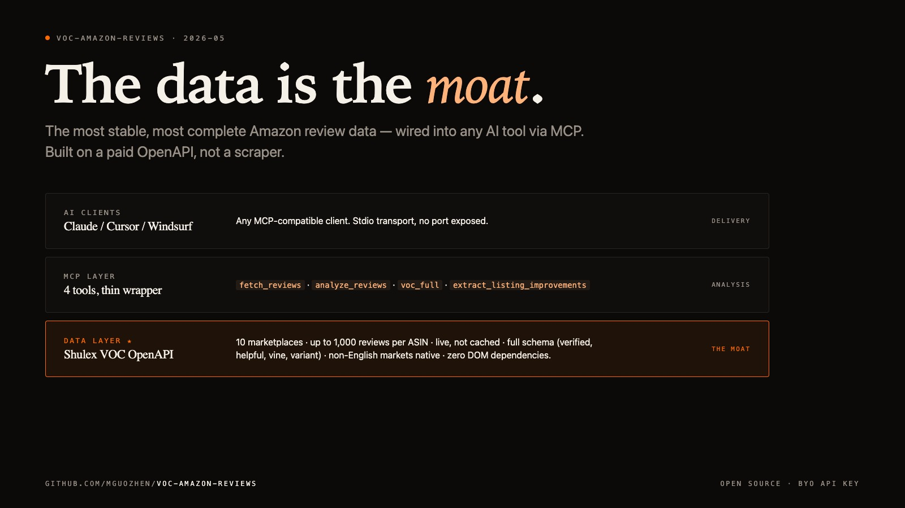

# Amazon 卖家工具的 99% 都在解决错的问题

> 真正的痛点不在 AI，**在数据**。
>
> 我们做了行业最稳定、最全的 Amazon 评论数据层 —— 然后顺手接到了 Claude。



---

## 一句话

**[voc-amazon-reviews](https://github.com/mguozhen/voc-amazon-reviews) 上线了 MCP server。** 但今天这篇不是讲 MCP，是讲为什么"评论数据"这件事 99% 的卖家工具都做错了，我们是怎么做对的，以及为什么这个东西值得开源。

---

## 卖家工具的"AI 焦虑"是个伪命题

过去 12 个月里，Amazon 卖家工具圈集体进入了"AI 化"军备竞赛。每家工具都说自己有 AI 评论分析。Helium 10 有。Jungle Scout 有。Data Dive 最近还发了个 MCP server。

但你打开任何一个工具的 demo，10 秒内就能闻到不对劲：

- **样本量过小** —— 同一个 ASIN，A 工具说"top pain point 是充电问题"，B 工具说"是按键松动"。**为什么俩工具读同一个 ASIN 结论不一样？** 因为他们读的不是同一批评论 —— 一个抓了 20 条，另一个抓了 50 条，而且都是几周前缓存的快照
- **多市场就废** —— 标榜"全球覆盖"的工具，95% 只在美区跑得动。德国站、日本站、英国站的评论要么完全没有，要么是机翻 + 缺失元数据
- **关键字段丢失** —— 是不是 verified purchase？helpful votes 多少？是不是 Vine Voice 测评？变体（颜色/尺寸）是哪个？这些字段在 80% 的工具里被静默丢弃。但**这恰恰是判断"这条差评是不是 KOL 黑稿"最关键的信号**
- **更新延迟** —— 大部分工具一天抓一次，新差评 24 小时后才进数据库。等你看到的时候，FYP 上已经传开了

这些问题加起来，让"AI 分析"这一层的价值上限被卡死了：**AI 再聪明，也只能基于你喂给它的数据回答**。喂给它 20 条几周前的快照，AI 给你的就是 20 条快照的结论。AI 不是问题。数据才是。

---

## 真正的护城河长这样

我们的判断很简单：在卖家工具这个赛道，**"AI 功能"是 commodity，会被同质化；"稳定 + 全的数据层"才是 moat**。所以这个项目从第一天起就死死压在数据层上：

| | 行业典型卖家工具 | voc-amazon-reviews |
|---|---|---|
| **数据来源** | 自建爬虫 / 没文档的私有 API | [Shulex VOC OpenAPI](https://apps.voc.ai/openapi)（付费、有 SLA、有合规） |
| **稳定性** | Amazon 一改 HTML 就全炸 | API 级别，零 DOM 依赖 |
| **市场覆盖** | 一般只支持美区 | **10 个**：US / CA / MX / GB / DE / FR / IT / ES / JP / AU |
| **单 ASIN 评论量** | 免费档 10–50 条封顶 | **单次最多 1,000 条** |
| **新鲜度** | 缓存快照，有的隔天才更 | 每次调用都打 live API |
| **评论字段** | 字符串裸跑，verified / helpful / variant 经常丢 | 完整 schema：评分、正文、verified-purchase、helpful votes、Vine Voice、变体、日期、评论 ID |
| **非英文市场** | 经常没有或者错乱 | 原文捕获 + AI 翻译，日德法意西全 native |
| **访问方式** | 必须用他们 UI | curl + JSON，全程可脚本，**MCP-ready** |

**为什么这件事难？** 因为 Shulex VOC OpenAPI 是个付费的、有信任门槛的数据通道 —— Shulex 跟 Amazon 之间有商业关系。这不是写个爬虫就能模仿的。我们做的事是：把这条专业级的数据通路，**完全开源地暴露给任何 AI 工具**。

---

## MCP server 只是分发通道

数据层定下来以后，怎么让 AI 工具用上？过去要写一个 SDK + 一套 SaaS 后端 + 一个仪表盘。**现在不用了 —— 这就是 MCP 的意义**。

MCP（Model Context Protocol）是 Anthropic 提的开放协议。Claude Desktop、Claude Code、Cursor、Windsurf 都已经原生支持。任何工具只要写成 MCP server，就能被这些 client 无缝调用。

我们的 MCP server 暴露 4 个工具，全部跑在同一个数据层上：

```
              Claude / Cursor / Windsurf
                        │
                        │   MCP (stdio)
                        ▼
                  mcp_server/  ← 4 个工具
                        │
              ┌─────────┼──────────────┐
              │         │              │
              ▼         ▼              ▼
      fetch_reviews  analyze_reviews  voc_full
        (raw data)   (data → insights) (一把梭)
                                       │
                                       ▼
                       extract_listing_improvements  ★
                       (data → 可贴的 listing 文案)
```

`fetch_reviews`、`analyze_reviews`、`voc_full` 是标准动作：抓 → 分析 → 出报告。

**`extract_listing_improvements` 是数据质量带来的奖励**。当你的数据足够全（1000 条评论 + 完整字段 + 多语言原文）时，AI 才有能力给出靠得住的 listing 改写建议：

```
输入：B0FAKE1234

输出 ─→ ┌─────────────────────────────────────────────────────────┐
        │ title_suggestion:                                       │
        │   "8-Hour Battery Pro Earbuds —                          │
        │    Premium Build, Stress-Tested USB-C"                   │
        │                                                          │
        │ bullet_suggestions:                                      │
        │   [1] "8+ hours of battery on a single charge —          │
        │       verified by 31 customer reviews"                   │
        │       ↳ addresses: Battery lasts 8+ hours on a charge    │
        │                                                          │
        │   [2] "Stress-tested USB-C port engineered for           │
        │       5,000+ insertions"                                 │
        │       ↳ addresses: Charging port loose after 2 weeks     │
        │       ...                                                │
        │                                                          │
        │ keyword_opportunities:                                   │
        │   - long battery earbuds                                 │
        │   - premium feel                                         │
        │   - stylish wireless                                     │
        │                                                          │
        │ warnings:                                                │
        │   - "Manual translation quality is a real product issue. │
        │      Better copy will not fix it; needs translator."     │
        └──────────────────────────────────────────────────────────┘
```

注意三个细节：

1. **每条 bullet 都附 `addresses` 引用** —— 这条建议是基于评论里哪条具体抗议或卖点。可追溯，可验证，不是 AI 编的
2. **`keyword_opportunities` 是买家原话** —— "comfy"、"doesn't look cheap"，不是 SEO 行业黑话
3. **`warnings` 主动指出哪些问题改 listing 解决不了** —— 如果是产品本身的问题，再好的文案也只是把烂产品推给更多人，只会让退款率更高

**这一切都建立在数据底下**。如果数据只抓了 30 条评论而且 verified=null，AI 给不出"verified by 31 customer reviews"这种数字，给不出"5,000+ insertions"这种针对性建议，也给不出"Vine Voice 评测语料 vs 普通用户"的区分。

---

## 技术架构

```
   ┌─────────────────────────────────────────────────────────┐
   │  MCP Client                                              │
   │  (Claude Desktop / Code, Cursor, Windsurf, ...)          │
   └─────────────────────┬───────────────────────────────────┘
                         │  MCP over stdio
                         ▼
   ┌────────────────────────────────────────────────────────┐
   │  mcp_server/server.py    (FastMCP, ~150 行)              │
   │     @mcp.tool() ×4                                       │
   └─────────────────────┬───────────────────────────────────┘
                         │  subprocess
                  ┌──────┴──────┐
                  ▼             ▼
              fetch.sh     analyze.sh
              ─────────    ──────────
              Shulex VOC   AI 语义分析
              OpenAPI      (报告渲染)
                  │             │
                  └──────┬──────┘
                         ▼
                ┌──────────────────────────────────┐
                │ Anthropic API (Claude Opus 4.7)  │
                │ ─ 仅用于 extract_listing_…       │
                │ ─ Prompt caching on the rubric   │
                │ ─ Structured pydantic outputs    │
                └──────────────────────────────────┘
```

**几个设计选择**：

- **MCP server 是个薄层** —— 不重写任何 scraping，直接 subprocess 调既有的 `fetch.sh` / `analyze.sh` / `voc.sh`。这些 shell 脚本另有 36 个单测覆盖，`mcp_server/` 自己再加 36 个全 offline 的 pytest 用例
- **Stdio transport，不开 HTTP 端口** —— 不暴露公网，不需要鉴权，client 直接把 server 拉成子进程
- **Prompt caching on the rubric** —— `extract_listing_improvements` 的 system prompt 是冻结的，跨 ASIN 调用共享缓存，单次成本可降 ~70%
- **Structured output via pydantic** —— Claude 直接出 typed 对象，不会发生"我以为是 JSON 结果他写成了 Markdown"的解析翻车

---

## 跟 Data Dive 的 MCP 对比

Data Dive 是这个赛道里最早接 MCP 的，本身是个好工具。但他们的 MCP 卡在数据这一层：

| | Data Dive MCP | voc-amazon-reviews MCP |
|---|---|---|
| **数据层** | 闭源、云锁定，你不知道底层抓了什么 | **开源 + 付费 OpenAPI**，可审计、可自托管 |
| **API key 归谁** | Data Dive 中转 | BYO Shulex + Anthropic，**无中介** |
| **市场覆盖** | 美区为主 | **10 个 marketplace 全 native** |
| **单次评论量** | 受限 | 单次最多 1,000 条 |
| **可追溯性** | 关键词没有引用源 | 每条建议都附 `addresses` |
| **产品问题预警** | ❌ | ✅ `warnings` 字段 |
| **改 listing 的具体文案** | ❌ 给关键词表自己想 | ✅ 出 title / 5 bullets / description |
| **自托管** | ❌ 只能用他们云 | ✅ 你的机器，你的 key |

不是说 Data Dive 不好用 —— 他们的关键词研究是行业标杆。**但关键词只是分析层**。**数据是底座**。底座不稳，分析层再花哨也只是漂亮的 UI。

---

## 30 秒装上

```bash
git clone https://github.com/mguozhen/voc-amazon-reviews.git
cd voc-amazon-reviews

python3 -m venv .venv
source .venv/bin/activate
pip install -r mcp_server/requirements.txt

export VOC_API_KEY="..."          # apps.voc.ai/openapi 免费注册
export ANTHROPIC_API_KEY="..."    # 仅 extract_listing_improvements 需要
```

然后在 Claude Desktop 配置文件 `~/Library/Application Support/Claude/claude_desktop_config.json` 加：

```json
{
  "mcpServers": {
    "voc-amazon-reviews": {
      "command": "/abs/path/to/.venv/bin/python",
      "args": ["-m", "mcp_server.server"],
      "cwd": "/abs/path/to/voc-amazon-reviews",
      "env": {
        "VOC_API_KEY": "your-key",
        "ANTHROPIC_API_KEY": "your-key"
      }
    }
  }
}
```

重启 Claude Desktop，你就能在 🔧 面板看到 4 个新工具。

跟 Claude 说："分析 B08N5WRWNW 的评论，给我改 listing 的具体建议。"——完事。

完整的 Cursor / Windsurf / Claude Code 配置在 [`mcp_server/README.md`](https://github.com/mguozhen/voc-amazon-reviews/tree/main/mcp_server)。

---

## 跑得多快、多便宜

- `fetch_reviews(asin, limit=100)` ── ~8–15 秒（Shulex API 负载相关）
- `voc_full(asin, limit=100)` ── ~12–25 秒（fetch + LLM 分析）
- `extract_listing_improvements(asin, limit=100)` ── ~30–60 秒（含 Opus 4.7 的 adaptive thinking）

成本：
- **Shulex VOC API**：100 条评论 ~60 credits，新账户送 starter 额度，验证想法不花钱
- **Anthropic API**：`extract_listing_improvements` 单次 ~$0.05–0.20（rubric 走 prompt cache 后更便宜）

跟"花两小时人工读 100 条评论"对比一下成本曲线，自己感受。

---

## 路线图：把数据层做厚

下一批工具，**全部围绕"把已经稳定的数据层用到更多场景"**：

- **`compare_asins([asin1, asin2, asin3])`** ── 同品类多 ASIN 横评，找差异化卖点切口
- **`monitor_review_drift(asin)`** ── 同一 ASIN 30 天前 vs 现在的差评分布对比，看产品有没有变质
- **`keyword_research_from_reviews(asin)`** ── 把买家在评论里用的词直接做成搜索词库（**不是抢量大的词，是买家已经在搜的词**）
- **`competitor_review_diff(my_asin, competitor_asin)`** ── 我跟对手的差评有什么本质区别，哪些是我能赢的

每加一个工具都是 `server.py` 里一个 `@mcp.tool()` + `tools.py` 里一个函数。所有工具共享一个数据底座 —— 数据层稳了，上面长多少花都是顺风车。

**如果你是 Amazon 卖家**：把你最痛的"我怎么也读不完的评论分析需求"告诉我，下一个工具按你的痛点来。

**如果你是开发者**：直接发 PR，或者复制 `mcp_server/` 结构去做你自己的 MCP server。整套设计 ~600 行 Python，比写一份 Notion 文档还短。

---

## 一句话再说一遍

> 关键词工具告诉你"哪些词热门"。
>
> 仪表盘工具告诉你"情绪 72% 正面"。
>
> 但读评论这件事 —— 真正决定改哪一行 listing 的事 —— 一直卡在**数据这一层**。
>
> 我们把数据层做稳了。开源、付费 API 底座、10 个 marketplace、单次 1000 条、live、完整 schema。
>
> 然后顺手接到了 Claude。

— [github.com/mguozhen/voc-amazon-reviews](https://github.com/mguozhen/voc-amazon-reviews)

---

*欢迎转发到任何卖家社群、Reddit r/FulfillmentByAmazon、Twitter、小红书电商号。如果你在你的视频/文章里提到，给我打个标签 ([@mguozhen](https://github.com/mguozhen))，我请你喝咖啡。*
